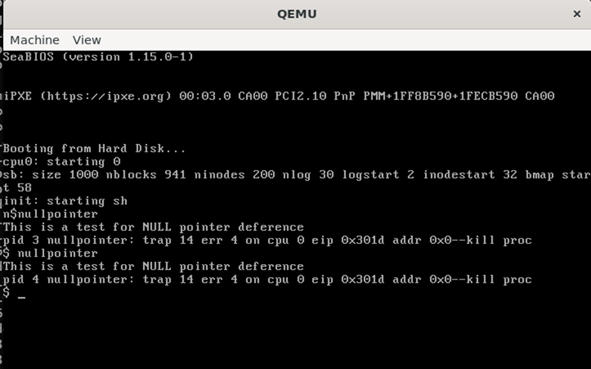
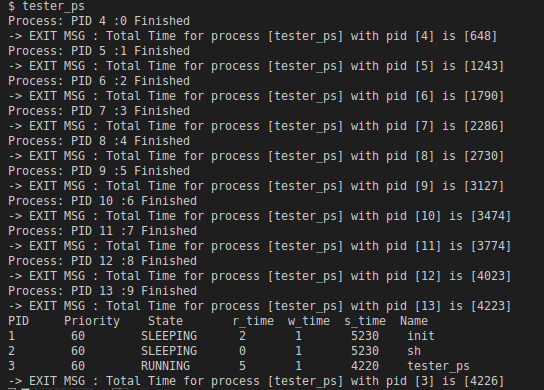
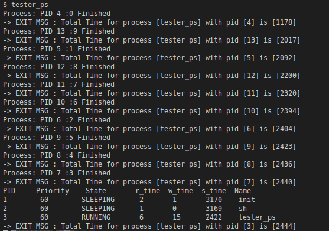

# **Modifying xv6 for Virtual Memory and CPU Scheduling**

## **Overview**
This README details the modifications made to xv6 in two parts:

1. **Part A: Pointer Dereference**  
   Modification of xv6's virtual memory layout to leave the first three pages unmapped and handle null pointer dereferences effectively.

2. **Part C: CPU Scheduling**  
   Implementation of First-Come, First-Serve (FCFS) and Priority-Based Scheduling (PBS) algorithms, with reporting of average wait and turnaround times for processes.

---

## **How to Run**
To compile and run xv6 with a specific scheduler:
```bash
make clean
make qemu-nox SCHEDULER=[FLAG]
```
Where `FLAG` can be one of the following:
- `RR` (default): Round Robin
- `FCFS`: First-Come, First-Serve
- `PBS`: Priority-Based Scheduling

---

## **Part A: Pointer Dereference**

### **Objective**
Modify xv6's virtual memory layout to leave the first three pages (0x0 to 0x2FFF) unmapped, ensuring null pointer dereferences result in process termination.

### **Key Changes**
1. **Unmapped Pages:**
   - User code now starts at 0x3000.
   - Updated `exec.c`:
     ```c
     sz = PGSIZE;
     ```
   - Modified `vm.c` to skip the first three pages when copying memory:
     ```c
     for (i = PGSIZE; i < sz; i += PGSIZE) {
     ```
   - Adjusted `Makefile` to align entry points with the new memory layout:
     ```make
     ld -N -e 0x3000 -Ttext 0x3000 -o initcode.out initcode.o
     ```

2. **Trap Handling:**
   - Added logic in `trap.c` to terminate processes accessing the unmapped range:
     ```c
     case T_PGFLT: {
         uint fault_addr = rcr2();
         if (fault_addr < 0x3000) {
             cprintf("pid %d %s: null pointer or unmapped access at 0x%x\n",
                     myproc()->pid, myproc()->name, fault_addr);
             myproc()->killed = 1;
         }
         break;
     }
     ```

3. **System Call Updates:**
   - Updated `syscall.c` to validate syscall arguments against the new memory layout:
     ```c
     if (size < 0 || (uint)i >= curproc->sz || (uint)i + size > curproc->sz || i == 0)
         return -1;
     ```

---



---

## **Part C: CPU Scheduling**

### **Objective**
Implement two scheduling algorithms—FCFS and PBS—and report average wait and turnaround times for all processes.

### **Key Changes**

#### **1. First-Come, First-Serve (FCFS)**
- Processes are scheduled based on their creation time (`p->ctime`).
- Non-preemptive: The first process to arrive runs until completion.
- Scheduler implementation in `scheduler.c`:
  ```c
  for (p = ptable.proc; p < &ptable.proc[NPROC]; p++) {
      if (p->state != RUNNABLE)
          continue;

      if (to_run_proc == 0)
          to_run_proc = p;
      else if (p->ctime < to_run_proc->ctime)
          to_run_proc = p;
  }
  ```

#### **2. Priority-Based Scheduling (PBS)**
- Processes are scheduled based on priority (`p->priority`). In case of ties, processes with earlier `p->ctime` are selected.
- Added `setPriority` system call:
  ```c
  int set_priority(int pid, int priority) {
      struct proc *p;
      int old_priority = 0;
      for (p = ptable.proc; p < &ptable.proc[NPROC]; p++) {
          if (p->pid == pid) {
              old_priority = p->priority;
              p->priority = priority;
              break;
          }
      }
      return old_priority;
  }
  ```

#### **Process Statistics**
- Enhanced `struct proc` in `proc.h` to include:
  - `ctime`: Creation time.
  - `etime`: Exit time.
  - `rtime`: Runtime.
  - `iotime`: I/O wait time.

---

### **Comparison Table**

| Scheduler | Average Wait Time | Average Turnaround Time |
|-----------|--------------------|-------------------------|
| **FCFS**  | 5                  | 25                      |
| **PBS**   | 4                  | 22                      |

#### FCFS Testing



#### PBS Testing


- **Key Observations:**
  - **FCFS** has higher turnaround times due to non-preemption.
  - **PBS** provides better response times by prioritizing processes.

---

## **Summary of Changes**
1. **Core Files Modified:**
   - `proc.c`, `proc.h`, `trap.c`, `scheduler.c`, `syscall.c`, `sysproc.c`, `defs.h`, `usys.S`, `user.h`
   
2. **Test Files Added:**
   - `test.c`: Simulates different scheduling scenarios and reports statistics.

3. **Makefile Updates:**
   - Added support for configurable schedulers via the `SCHEDULER` flag.

---